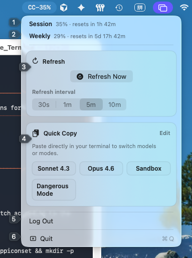

# Claude Usage Monitor
A macOS menu bar app that displays your Claude.ai usage limits and reset windows.



## Installation
Download the latest release for Apple Silicon or Intel from [GitHub Releases](https://github.com/chen5656/claude-usage-monitor/releases).

**Build from source:**
```bash
xcodebuild -project ClaudeUsageMonitor.xcodeproj -scheme ClaudeUsageMonitor -configuration Debug build CODE_SIGN_IDENTITY="" CODE_SIGNING_REQUIRED=NO CODE_SIGNING_ALLOWED=NO
```

## Security & Privacy
- Uses formal Claude OAuth (with PKCE) and local callback.
- Tokens are securely stored **only** in the macOS Keychain.
- If macOS prompts for Keychain access on launch, click **Always Allow**. (To avoid prompts entirely, build from source and sign with an Apple Developer certificate).
- See [Privacy Policy](./PrivacyPolicy.md).

## Usage
1. Launch the app and choose either `Log in with Claude.ai` or `Try Demo Mode`.
2. After successful browser OAuth, the menu bar updates (e.g., `CC-42%`).
3. In demo mode, the menu bar shows `DEMO-xx%` and sample reset windows.
4. Click the menu bar item to view details, refresh, change intervals, or use quick-copy shortcuts.

## License
MIT. See [LICENSE](./LICENSE).
